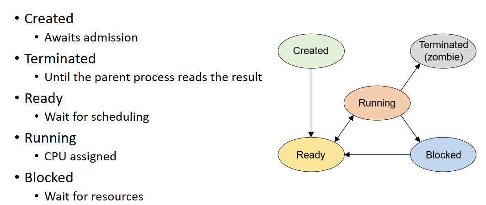

# jak probíhá komunikace s externím zařízením

spoustu řádků, co se tam děje, stejně si to nikde nedokáže zapamatovat

## způsoby získání dat z externího zařízení
#### 1) polling
- CPU se neustále ptá, jestli je něco nového
#### 2) přerušení
- zařízení pošle signál, že je něco nového
- CPU přeruší co dělá a začne zpracovávat to přerušení
- procesor má na přerušení vyhrazen alespoň jeden pin
#### 3) Direct Memory Access (DMA)
- zařízení samo přenese data do paměti

## Druhy přerušení
### 1) Externí přerušení
- přichází z HW, používá nějaký speciální pin
### 2) (Hardware) Exception
- neočekávaně ho spustí nějaká instrukce, asi když se něco pokazí
### 3) Software 
může být použito k volání systémových funkcí

## co se děje při přerušení:
- když to vyvolá zařízení, tak je k tomu předdefinováno, co se bude dělat

...   °_°

# Processing

## Definice:
Program
- posloupnost instrukcí

Proces
- instance programu, která běží v paměti

Vlákno
- jedna aktivita v procesu

Fiber
- lehké vlákno, idk - menší jednotka plánování

Windows a linux mají různý přístup k tomu, jaký vztah mají rodič a syn procesy vztah

### Plánovač
- část OS, rozděluje zdroje mezi procesy

### Multitasking
- najednou vykonává více procesů

### Multiprocesing
- najednou běží více procesů na více procesorech

### Kontext
- stav procesu, který se musí uložit, když se přepíná mezi procesy, jsou to registry, program counter, atd.
### Kontextový přepínač
- přepnutí mezi procesy, kdy se uloží kontext jednoho a načte se kontext druhého procesu

## Real-time plánování
- každý proces má nějaký start a stop čas, který určuje, do kdy má trvat

buď je po uplynutém čase ten výpočet už zbytečný, nebo jen trochu zbytečný - hard a soft deadline

každý proces může přecházet mezi různými stavy:
