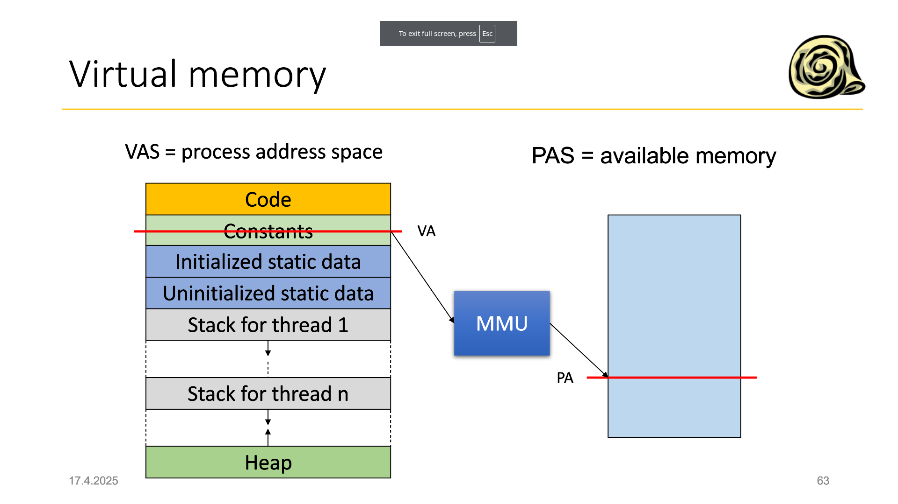
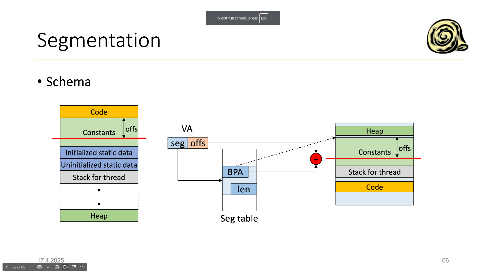
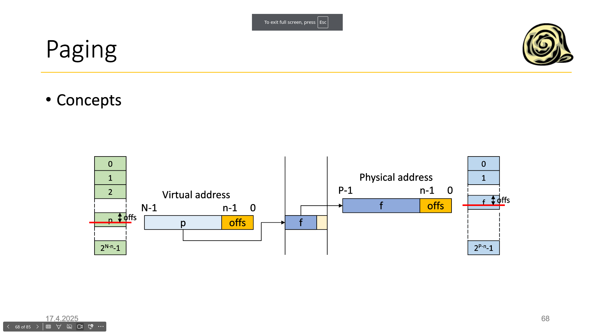
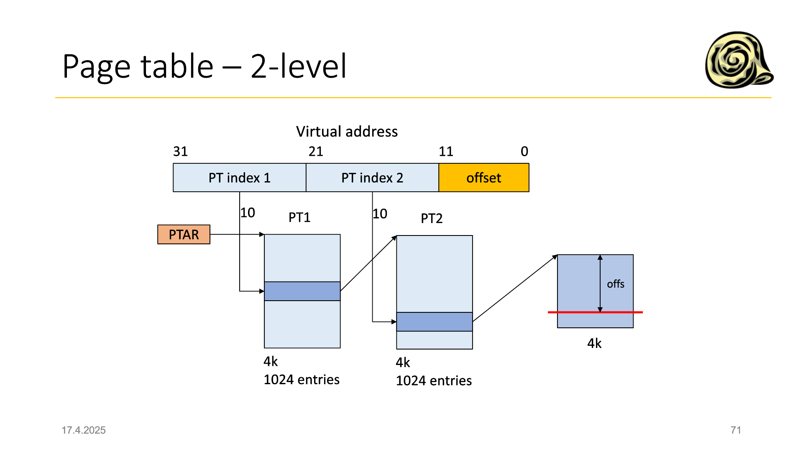

Abstrakce nad HW diskem:

Partition table

- třeba na začátku disku se zapíše tabulka oddílů, pak se disk tváří, jako více disků
- př UEFI vyžaduje, aby na disku byla partition na tento program
- nebo oddíl swap 

RAID:
Redundant Array of Independent Disks

## Virtuální paměť
- v průběhu vývoje přišli na to, že na RAM se nevejde vše co potřebují

- všechny přístupy do paměti se provádějí přes virtuální adresy
- Operační systém přeloží virtuální adresy na fyzické adresy

překládání adres se dělá hardwarově (nejde to instrukcemi, protože ty jsou taky odkazy do paměti)
- překlad nemusí existovat, musíme to nějak detekovat - ten HW vyvolá výjimku procesoru

- původně byl udělán virtuální adresní prostor, aby byl větší, než ten fyzický - pak procesor odkáže proces na část disku

- dneska je to, hlavně, aby proces sahal do paměti jinému procesu - **bezpečnost**

### Segmentace
- paměť se dělí na segmenty - každý segment má jinou velikost

- virtuální adresy jsou dvojice (segment, offset)
    - segmenty jsou př. kód, konstanty, data, zásobník

() - musím si pamatovat i vlastnost daného segmentu - read only, ...

- problém segmentace je, že segmenty musí být úplně a souvisle v paměti

- vím segment a jeho offset, podívám se do tabulky segmentů, kde mám fyzickou adresu začátku segmentu a jeho velikost
- to spolu s offsetem mi dá fyzickou adresu (jedno číslo)

- když není místo v paměti na partition, tak se můžu rozhodnout nějakou partition vyhodit
- ta se pak zapíše na disk
- trvá to dlouho :sad:
## Stránkování
- paměť se dělí na stránky - stránky jsou velké $2^n$ a jsou stejně velké (př 4kB)

virtuální adresa se skládá z čísla stránky a offsetu - rozdělení bitů - nižších 12 bitů (to je podle velikosti stránky) je offset a zbytek je číslo stránky

- offset se kopíruje mezi virtuální a fyzickou adresou
- protože velikost stránek a segmentů je stejná

- velikost stránkového pole musí být stejná jako množství virtuálních rámců
- některé z nich můžou být prázdné (pak vrátí page fault)

Problémy se stránkovací tabulkou:

- je to neefektivní, protože každý přístup do paměti musí musí přistoupit také do tabulky - 2x zpomalení
- dám si tu tabulku dám do TLB paměti - ta je rychlá - asociativní paměť

- používají se víceúrovňové tabulky

PTAR ukazuje na začátek tabulky 1. úrovně
- kouzelně to vychází na to, že stránkovací tabulka 1. úrovně je také 4kB
- je tam 1024 položek po 4B

- indexuji do tabulky 1. úrovně a dostanu odkaz na fyzickou adresu tabulky 2. úrovně (to je v těch 4B)
- tabulka 2. úrovně je dost podobná - 1024 položek po 4B

- stránka 2. úrovně je schopná pokrýt 4MB paměti
- stránka 1. úrovně je schopná pokrýt 4GB paměti
- a tabulky jsou velké 4kB - ušetřím hodně paměti

- tabulku 1. úrovně musím mít v paměti, ale tabulku 2. úrovně můžu vytvořit až za běhu